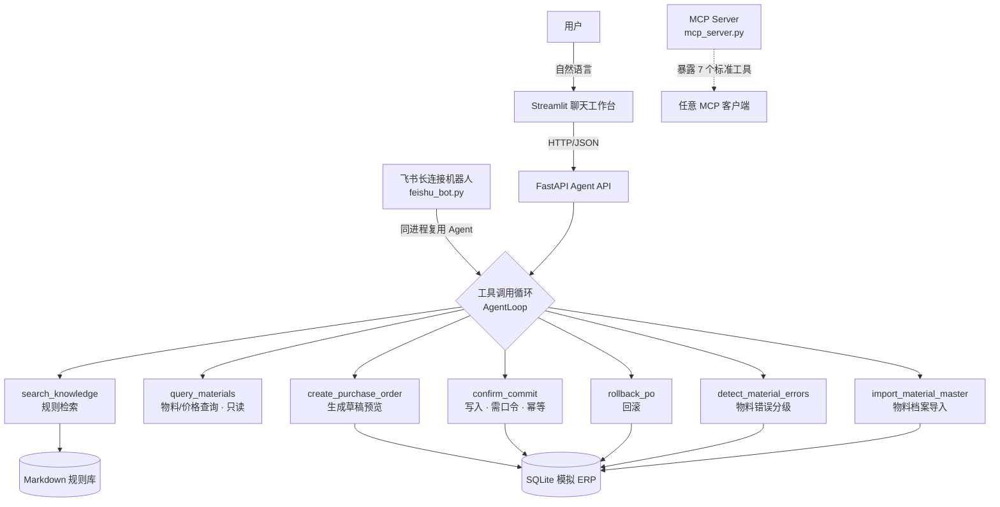

# 外贸 ERP 安全操作 Agent


这是一个面向 FDE / AI 应用工程岗位的可运行作品：用完全合成的数据还原“BOM → 采购 PO”流程，展示**工具调用循环 Agent**（Function Calling）、多轮对话、MCP 工具暴露、RAG 检索、业务校验、写前确认、幂等、审计和回滚，并配套**可复现的能力评测集**。

项目当前进度、问题、缺口和下一步统一记录在 `PROJECT_STATUS.md`。每次实质改动结束前都应同步更新该文件。

> 安全声明：项目不连接任何真实企业生产系统；供应商、合同、物料、价格和单号均为虚构数据。程序只加载项目目录内的合成资料，不会读取其他位置的文件。

## 一、3 分钟能看到什么

1. 用自然语言对话：「帮我根据 `正常示例_BOM.xlsx` 生成采购 PO 草稿，先给我看金额」。
2. 模型自主决定调用工具（可展开看工具调用轨迹），生成草稿并停下等确认。
3. 输入 `确认提交`，模型才会调用写入工具；重复确认不会重复建单。
4. 追问「查一下 MAT-FAB-001 的价格」——模型只查询、不建单，体会 agent 的多轮能力。
5. 切到“订单与审计”查看操作记录，再演示回滚。
6. 换成 `异常示例_BOM.xlsx`，展示未建档物料和非法数量如何阻止写入。

## 二、架构



核心设计是「受控工具调用 Agent」：模型通过 Function Calling 自主决定调用哪个工具、传什么参数、调用顺序与次数，因此具备 agent 的多轮、自主编排能力；但**金额计算、业务校验和写入口令始终由确定性代码完成**，模型只做编排不做决定。断网或模型幻觉都不会造成错误写入。

## 三、本地启动

### 最省事：Windows 一键启动（推荐）

在本目录打开 PowerShell：

```powershell
python -m pip install -r requirements.txt
.\start_demo.cmd
```

`.cmd` 不受 PowerShell 脚本执行策略限制。退出 Streamlit 时，启动器会一并停止后台 API。

如果本机环境允许 PowerShell 脚本，也可以使用 `start_demo.ps1`；不建议为本项目修改系统的全局执行策略。

启动器会等待 API 和页面都就绪后尝试自动打开浏览器；如果浏览器没有自动打开，请手动访问 `http://127.0.0.1:8501`。API 文档位于 `http://127.0.0.1:8000/docs`。

### 分两个终端启动

终端 1：

```powershell
python -m uvicorn api:app --host 127.0.0.1 --port 8000
```

终端 2：

```powershell
python -m streamlit run ui.py
```

### Docker Compose

```powershell
docker compose up --build
```

然后访问 UI `http://localhost:8501`、API 文档 `http://127.0.0.1:8000/docs`。

验证容器是否真的跑通（8 项检查：健康检查、核心端点、容器内业务链路、UI 健康）：

```powershell
python smoke_docker.py
```

> 网络提示：若 `docker compose build` 卡在拉取 `python:3.13-slim`，说明直连 Docker Hub 不通。
> 在 `%USERPROFILE%\.docker\daemon.json` 加入 `registry-mirrors` 并重启 Docker Desktop 即可：
> ```json
> { "registry-mirrors": ["https://docker.1panel.live", "https://docker.m.daocloud.io"] }
> ```
> 注意：给 daemon 配代理通常无效，因为代理软件一般只监听 `127.0.0.1`，WSL2 经 NAT 访问不到。

MCP 工具也可单独验证（stdio 协议，7 个工具）：

```powershell
python smoke_mcp.py
```

### 飞书对话入口（可选，无需公网）

除了网页工作台，也可以把**同一个 Agent** 接进飞书对话——在飞书里直接发消息，不必每次打开网页。

原理是**飞书自建应用 + 长连接（WebSocket）**：机器人主动连到飞书，因此**不需要公网 IP、域名或内网穿透**，本机常驻一个进程即可。

```powershell
.\.venv\Scripts\python.exe feishu_bot.py
```

Windows 下双击 `start_feishu.cmd` 更省事。启动后在飞书里搜到你的机器人，直接发消息即可（群里需要 @ 机器人）。

`.env` 中的飞书配置项：

```dotenv
FEISHU_APP_ID=cli_你的AppID
FEISHU_APP_SECRET=你的AppSecret
# 可选：只允许这些 open_id 使用（逗号分隔）。留空 = 不限制。
FEISHU_ALLOWED_OPEN_IDS=
# 可选：群里被 @ 时才响应（单聊不受影响）。
FEISHU_REQUIRE_MENTION_IN_GROUP=true
```

飞书开发者后台还需完成 4 步：① 添加「机器人」应用能力；② 权限管理开通 `im:message`、`im:message:send_as_bot`、`im:resource` 等；③ 事件与回调选择**长连接**并订阅 `im.message.receive_v1`；④ 版本管理与发布。

> 安全边界完全不变：机器人只是「翻译层」，金额计算、业务校验与写入口令仍由确定性代码执行，飞书里同样要说「确认提交」才会写入。长连接需**单实例常驻**（会话与幂等状态在进程内存中）。完整步骤与踩坑记录见 `docs/飞书接入方案.md`。

## 四、验证

```powershell
python generate_samples.py
python -m unittest discover -s tests -v
python -m py_compile api.py ui.py erp_agent\*.py
```

当前自动化测试覆盖：

- 工具层：正常/异常草稿、金额验算（¥24164）、写入口令、幂等、回滚、物料查询；
- 工具调用循环：模型调工具→返回结果→停止、无工具直接回复、多轮历史；
- 意图识别：LLM 正常/白名单外/网络异常/回退规则；
- 正常 BOM 生成草稿并确认写入；
- 同一 action_id 重复确认不重复建单；
- 错误确认口令被拒绝；
- 异常 BOM 被阻断；
- 已提交采购 PO 可回滚且保留审计记录；
- BOM 解析（CSV、表头别名、空行、非法格式）；
- API 层（健康检查、确认幂等、404/409、缺文件 400）。

### 能力评测（evals）

项目内置评测集 `evals/`，覆盖金额正确性、异常识别与阻断、写操作安全边界、幂等写入、回滚可追溯、工具选择准确率、安全指令遵守率等维度。

```powershell
python evals/run_eval.py --offline   # 确定性层，无需模型密钥（CI 使用）
python evals/run_eval.py             # 全量，真实调用模型
```

- CI 离线确定性层：**8/8 通过（100%）**；
- 最近一次全量评测（含真实模型调用）：**15/15 通过**，含"只查询不得建单"等安全对抗用例。

完整报告见 `evals/REPORT.md`，随每次评测自动刷新。

## 四·一、模型配置（工具调用循环）

`/agent/chat` 依赖具备工具调用（Function Calling）能力的模型来编排工具。模型只做编排，金额/校验/写入仍在确定性代码里；不配置模型时 `/agent/chat` 返回不可用提示，`/agent/prepare` 仍可离线运行。

### 方式一：云端智谱（推荐，开箱即用）

```dotenv
LLM_BASE_URL=https://open.bigmodel.cn/api/paas/v4
LLM_MODEL=glm-4-flash
LLM_API_KEY=你的key
```

### 方式二：本地 Ollama（离线，需较大模型）

```powershell
ollama pull qwen2.5:7b
```

```dotenv
LLM_BASE_URL=http://127.0.0.1:11434/v1
LLM_MODEL=qwen2.5:7b
```

> 注意：`qwen2:1.5b` 这类小模型工具调用不稳定（连意图都常判错），建议至少 `qwen2.5:3b`、推荐 `qwen2.5:7b`。

意图识别与工具编排的安全设计：模型输出经白名单与别名归一化校验；金额计算、业务校验、写入口令全部由确定性代码执行。因此模型幻觉、误判或断网都不会影响金额、校验与写入。

## 五、主要接口

| 方法 | 路径 | 作用 |
|---|---|---|
| GET | `/health` | 健康检查 + `llm_enabled`/`llm_model`（可判断模型是否真在工作）|
| POST | `/agent/chat` | 多轮对话：模型自主编排工具完成采购业务 |
| POST | `/agent/prepare` | 确定性六步流水线（离线兼容） |
| POST | `/agent/confirm` | 使用明确口令确认写入 |
| POST | `/agent/rollback` | 回滚已写入的采购 PO |
| POST | `/agent/detect` | 物料错误检测：解析 BOM → 逐行校验 → 分级报告 |
| GET | `/orders` | 查看模拟 ERP 单据 |
| GET | `/audit` | 查看审计日志 |
| GET | `/error_reports` | 查看物料错误报告推送队列 |
| GET | `/samples` | 列出可用示例文件 |
| GET | `/materials` | 列出模拟 ERP 物料档案 |
| POST | `/materials/import` | 导入物料档案（已存在编码则更新价格） |

另有 `mcp_server.py`：把 7 个工具暴露为标准 MCP 工具，可接入任意 MCP 客户端（Claude Desktop、Cursor 等）。

## 六、代码阅读顺序

1. `erp_agent/tools.py`：7 个业务工具的 schema 与确定性实现（金额/校验/口令都在这里）。
2. `erp_agent/llm.py`：`AgentLoop` 工具调用循环 + `IntentClassifier` 意图识别。
3. `erp_agent/agent.py`：`chat()` 多轮入口 + `prepare()` 兼容流水线。
4. `erp_agent/parser.py`：BOM 与物料档案（.xlsx/.csv）解析、表头别名归一。
5. `erp_agent/knowledge.py`：离线 RAG 检索和来源返回。
6. `erp_agent/repository.py`：SQLite、预览、幂等、审计和回滚。
7. `erp_agent/validator.py`：物料错误检测的确定性校验与分级。
8. `api.py`：FastAPI 接口。
9. `mcp_server.py`：MCP 工具暴露。
10. `ui.py`：Streamlit 聊天演示页。
11. `feishu_bot.py`：飞书长连接机器人适配层（飞书事件 → Agent → 回复，复用同一 Agent，安全边界不变）。

## 七、项目边界与生产化路线

- **数据边界**：项目全部使用合成数据与模拟 ERP 还原业务流程，不连接任何真实企业生产系统（见文首安全声明）。
- **Agent 定位**：工具调用循环 Agent（Function Calling）——模型自主编排工具，但金额计算、业务校验与写入口令等关键决策由确定性代码兜底；这是有意的安全设计，并非"完全自主智能体"。
- **RAG 现状**：轻量本地检索，重点是可追溯与离线稳定；生产化可替换为 BGE + Chroma/PGVector 向量检索。
- **写操作安全**：确定性规则、权限与审计全部位于 LLM 之外，本项目即按此原则设计。
- **生产化路线图**（后续迭代）：SSO/RBAC、审批流、密钥管理、消息队列、监控告警、真实 ERP API 适配器、灰度发布。
