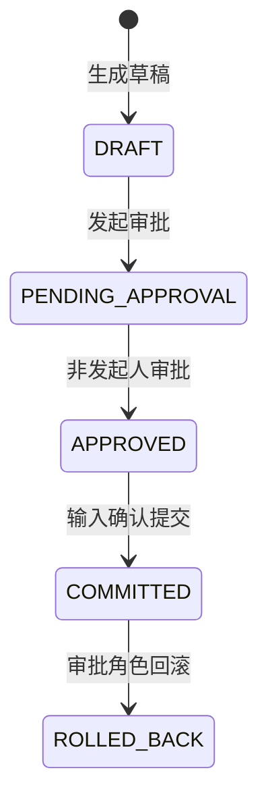

# 权限与审批状态机

## 1. 设计目标

模型只能建议调用工具，不能声明自己是谁，也不能通过 tool arguments 伪造 `operator`。身份由 API Bearer Token、飞书 `open_id` 或 MCP 服务令牌绑定；工具层在执行前再次校验角色。

RBAC 默认关闭，保证合成数据 Demo 开箱即用。开启后，所有业务入口都必须提供已配置身份；这是一套可验证的演示安全边界，不替代生产 SSO、OAuth、密钥托管或企业 IAM。

## 2. 角色

| 角色 | 允许操作 |
|---|---|
| viewer | 查询物料、知识检索、错误检测、查看审批/订单/审计 |
| operator | viewer 的业务能力 + 导入档案、生成采购草稿、发起审批 |
| approver | 查看 + 审批他人草稿、确认写入、回滚 |

发起人与审批人必须不同。即便同一用户同时获得 operator/approver 两种上下文，数据库状态机仍会拒绝自审。

## 3. 状态迁移



当前实现创建草稿后立即发起审批，因此 `DRAFT` 与 `PENDING_APPROVAL` 分别写入审计，查询时通常看到 `PENDING_APPROVAL`。兼容模式下，非发起人的确认动作可在同一事务内补做审批；启用 RBAC 时推荐显式调用 `/agent/approve` 后再确认。

## 4. 本地配置

在 `.env` 中使用随机 Token，禁止把真实值写入文档或 Git：

```dotenv
ERP_AUTH_ENABLED=true
ERP_AUTH_IDENTITIES_JSON={"随机tokenA":{"user_id":"operator_demo","role":"operator"},"随机tokenB":{"user_id":"approver_demo","role":"approver"}}
```

HTTP 请求使用：

```text
Authorization: Bearer 随机tokenA
```

Streamlit 可在侧栏临时填写 Token；MCP 使用 `ERP_MCP_API_TOKEN`。飞书入口将可信 `open_id` 与身份配置中的 `user_id` 对应，未配置用户会被拒绝。

## 5. 不可绕过的检查

1. API 层返回 401/403，提供清晰的认证与授权语义。
2. ToolRegistry 再次检查角色，避免绕过 REST 直接调用工具。
3. 传给模型的工具 schema 不包含可修改的操作人字段。
4. Repository 检查发起人与审批人分离，并在同一事务内完成状态更新、业务写入和审计。
5. 重复审批、重复确认和重复回滚保持幂等。
